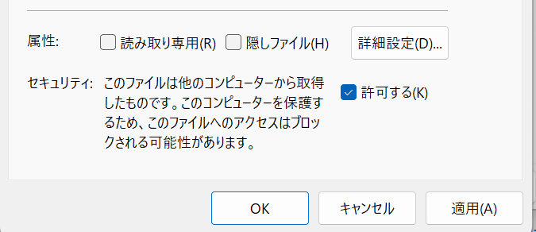
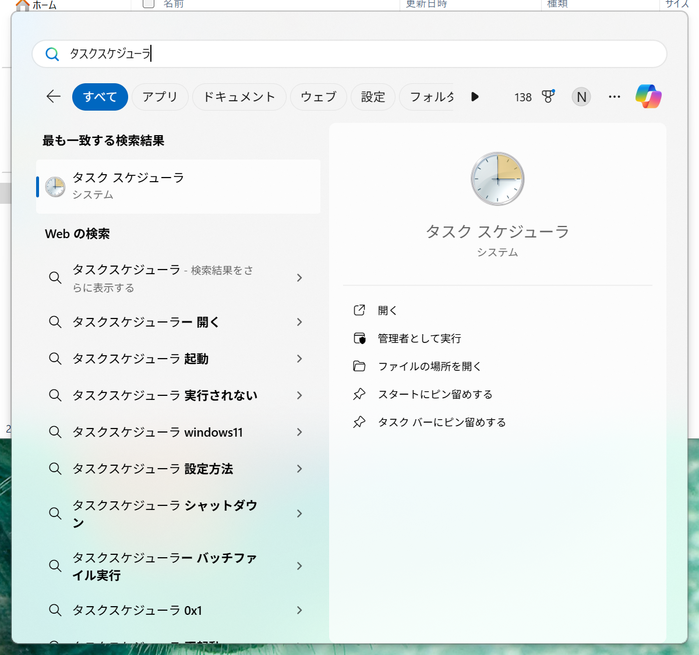
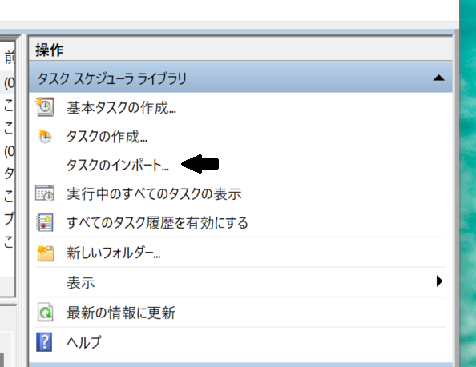

# Record-WorkedTimeAndDesktopName トラブルシューティング

Virtual Desktop モジュールのインストールに失敗した場合やタスクの登録に失敗した場合に試す手段について示す。

## Virtual Desktop モジュールのインストールに失敗した場合

### `Install-Module` コマンドが機能することを手動で確認する

Windows PowerShell で以下の順にコマンドを実行し、 Virtual Desktop モジュールをインストール・インポートする。

```powershell
Install-Module VirtualDesktop -Scope CurrentUser
Set-ExecutionPolicy RemoteSigned -Scope Process
Import-Module VirtualDesktop

# Virtual Desktop モジュールのインストールとインポートに成功していれば
# 以下のコマンドの実行でデスクトップ名を取得できる。
Get-DesktopName
```

このコマンドが成功すれば、 Virtual Desktop モジュールのインストールは完了である。
なぜインストールに失敗したかは不明だが、スクリプトから呼び出す `Import-Module` コマンドレットの実行に制限がかけられているのかもしれない。

### `Install-Module` コマンドでモジュールをインストールできない場合

もし、 PC に何らかの制限がかけられていてモジュールをインストールできなかった場合、手動ダウンロードによるインストールなら可能かもしれない。

#### モジュールの nupkg ファイルをダウンロードする

手動でモジュールをダウンロードするために [Virtual Desktop モジュール](https://www.powershellgallery.com/packages/VirtualDesktop/1.5.10) のページの [Manual download] タブから nupkg ファイルをダウンロードする。これは NuGet 向けに圧縮されたファイルである。


ダウンロード後、　PowerShell でファイルを展開するのであれば、以下の順にコマンドを実行する。

```powershell
Unblock-File -path .\virtualdesktop.1.5.10.nupkg
Rename-Item .\virtualdesktop.1.5.10.nupkg .\virtualdesktop.1.5.10.zip
Expand-Archive .\virtualdesktop.1.5.10.zip
```

エクスプローラー上でファイルを展開するのであれば、まずダウンロードした virtualdesktop.1.5.10.nupkg を右クリックし、ファイルへのアクセスを許可する。



そしてファイルの拡張子を .zip に変更し、右クリックメニューから zip ファイルを展開すればよい。

#### モジュールを手動で配置する（インストールしたように見せかける）

Windows PowerShell で `$Env:PSModulePath` を実行すると、モジュールの配置場所がわかる。

```powershell
$Env:PSModulePath
C:\Users\xxx\Documents\WindowsPowerShell\Modules;C:\Program Files\WindowsPowerShell\Modules;C:\WINDOWS\system32\WindowsPowerShell\v1.0\Modules
```

管理者権限なしでモジュールをインストールする場合、 `C:\Users\<ユーザー名>\Documents\WindowsPowerShell\Modules` に配置されるようなので、この場所に `C:\Users\<ユーザー名>\Documents\WindowsPowerShell\Modules\VirtualDesktop\1.5.10` フォルダを作成する。

そして、先ほど展開したファイルのうち、以下の 5 ファイルを `1.5.10` フォルダへ配置する。

- [Content_Types].xml
- functions.cat
- VirtualDesktop.ps1
- VirtualDesktop.psd1
- VirtualDesktop.psm1


この状態で PowerShell で以下のコマンドを実行できれば手動インストール成功である。

```powershell
Set-ExecutionPolicy RemoteSigned -Scope Process
Import-Module VirtualDesktop
Get-DesktopName
```

### Virtual Desktop モジュールの削除手順

何らかの理由で Virtual Desktop モジュールを削除しなければならなくなった場合、以下のコマンドを実行すればよい。

```powershell
Uninstall-Module VirtualDesktop
```

なお、手動で Virtual Desktop モジュールをインストールした場合、このコマンドでは削除できない。直接エクスプローラーから削除すること。

## タスクスケジューラーへのタスクの登録に失敗した場合

### タスクスケジューラーへタスクをインポートする

`User_Install-as-Admin.bat` を実行してインストールを進めると、 `src/Record-WorkTimeAndDesktopName.xml` が生成される。この XML ファイルをタスクスケジューラーへインポートすれば、タスクを作成することができる。

[TASK-DESCRIPTION.md](./src/TASK-DESCRIPTION.md) に記載の通り、タスクスケジューラーの引数を変数化する工夫を凝らしているため、 GUI からタスクを作るのではなく、 XML ファイルのインポートが必須となる。

まず、スタートメニューからタスクスケジューラーを起動する。



右ペインの操作メニューから［タスクのインポート］を選択し、 `src/Record-WorkTimeAndDesktopName.xml` を選択する。



これで準備完了である。
