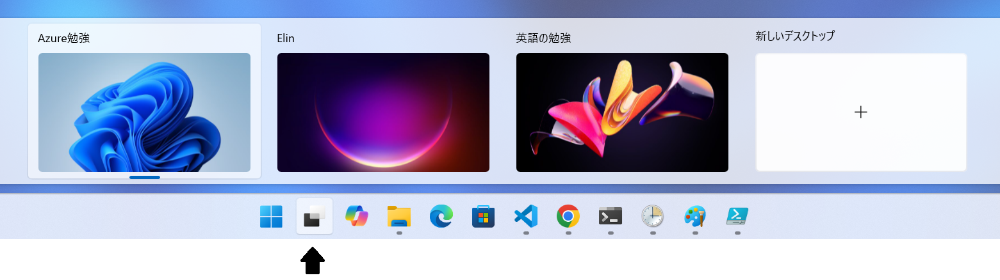
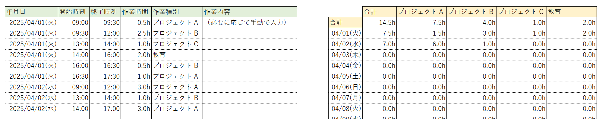
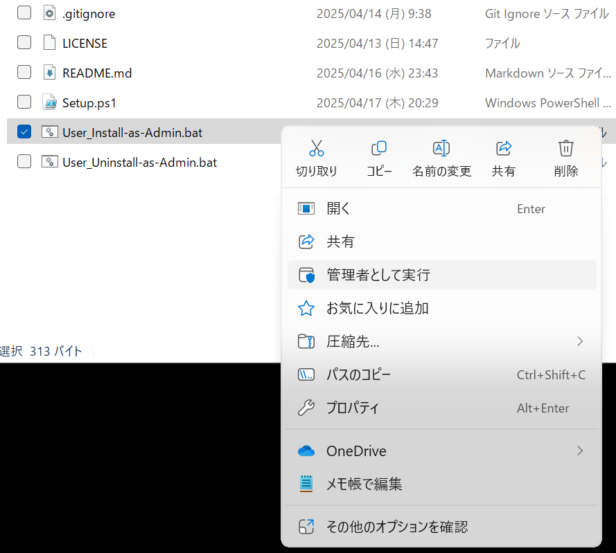
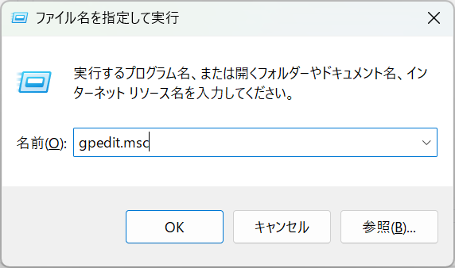
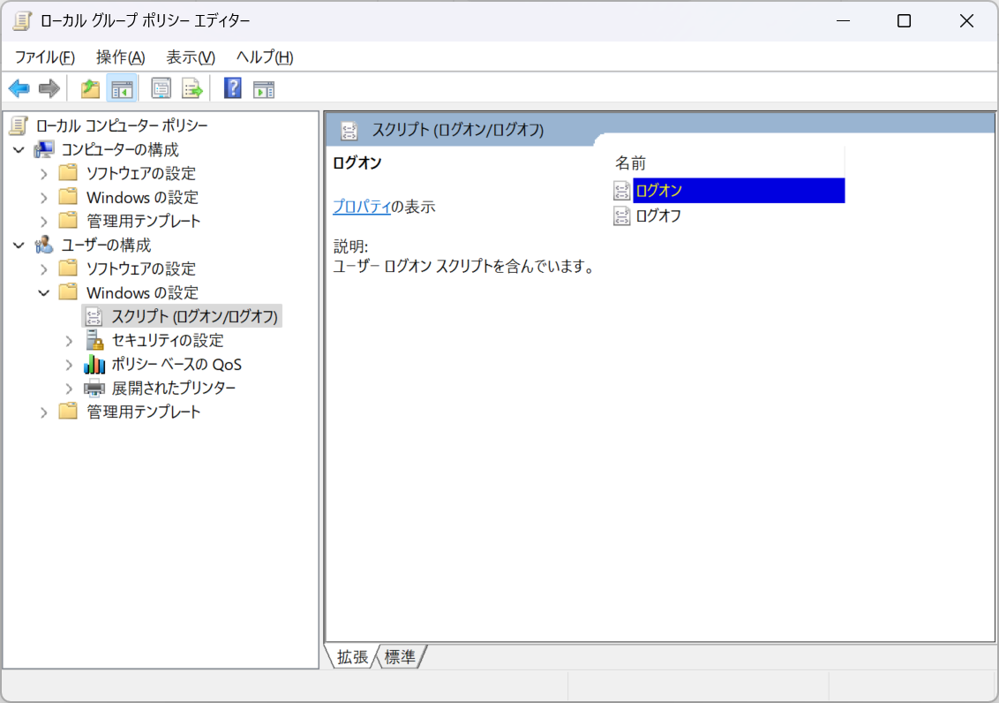
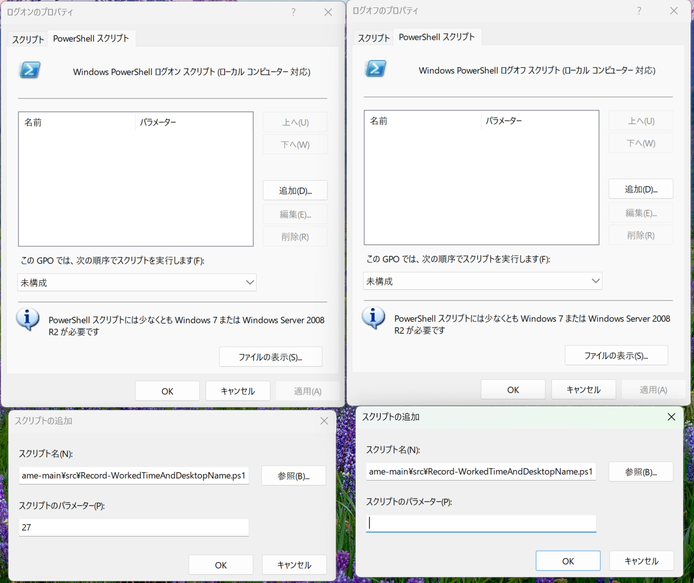
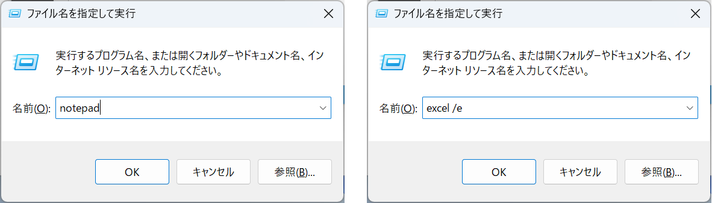

# Record-WorkedTimeAndDesktopName

現在の時刻とデスクトップ名を取得し、タブ区切りテキストとしてファイルへ書き込む。

## 目的

ある条件を満たした場合に Windows 11 の「仮想デスクトップ」の名称と現在の日時を以下のようにタブ区切りテキスト（ tsv ファイル）として保存すること。

```text
2025/04/02	2025/04/02 09:00	2025/04/02 12:00	3.0	プロジェクト A
2025/04/02	2025/04/02 13:00	2025/04/02 14:00	1.0	プロジェクト B
2025/04/02	2025/04/02 14:00	2025/04/02 17:00	3.0	プロジェクト A
```

それぞれの項目は「年月日」・「開始日時」・「終了日時」・「作業時間」・「作業分類」を意味する。

保存の契機とする条件は以下の通り。

- 5 分ごと（タスクスケジューラーは 5 分ごとの実行が最小の単位）
- PC の起動時（ Windows 11 Pro 以上の場合はユーザーログオン時）
- PC のシャットダウン・休止状態の実行時（ Windows 11 Pro 以上の場合はユーザーログオフ時）

### 目的の深掘り

Windows 11 には「仮想デスクトップ」機能が搭載されており、下図のようにデスクトップ画面を複数作成し、それぞれに名前を付けることができる。



「各デスクトップ画面それぞれの名称をタスク名とみなせば、利用中のデスクトップのアクティブ時間を計測することで、各タスクに費やした時間を計測できるのでは？」という思い付きのお試し実装がこれ。

まず、 Windows PowerShell の追加モジュールを使ったスクリプトを、タスクスケジューラーで定期的に呼び出し、以下のようなタブ区切りテキストファイル（ .tsv ）を出力する。

続いて、タブ区切りテキストはエクセルにコピペで貼り付ける。以下のような Excel ファイルを作っておき、「年月日」・「開始時刻」・「終了時刻」・「作業時間」・「作業種別」欄に貼り付ける。



~~もしこのスクリプトの使い勝手が良ければ、最初から Excel に出力するように改造するかもしれない。~~ このスクリプトを実際に仕事で使ってみたところ、上図の「作業内容」を入力したくなることが多く、結局は普通に手入力で作業時間を計測したほうが良いと感じた。

ただ、自宅で使う分には、別に「作業内容」を入力しなくてもよいので、自動計測できるのは割と便利だった。

## 必要なツール

基本的に必要なツールは Windows 11 にプリインストール済み。 PowerShell のバージョンは、 PowerShell で `$PSVersionTable.PSVersion` を実行することで確認可能。Virtual Desktop モジュールはインストール手順実行中にダウンロードするため、個別のインストール作業は不要。

Windows 11 Home の場合：

- Windows PowerShell 5.1 以上
  - [Virtual Desktop モジュール](https://www.powershellgallery.com/packages/VirtualDesktop/1.5.10) 1.5.10 以上
- conhost.exe
- タスクスケジューラー

Windows 11 Pro 以上の場合：

- Windows PowerShell 5.1 以上
  - [Virtual Desktop モジュール](https://www.powershellgallery.com/packages/VirtualDesktop/1.5.10) 1.5.10 以上
- conhost.exe
- タスクスケジューラー
- ローカルグループポリシーエディター

Windows 11 Home か Pro 以上かでタスクスケジューラーの使い方を変えている。 Home の場合はタスクスケジューラーの機能を用いて PC 起動・終了時刻を記録するが、 Pro 以上の場合はローカルグループポリシーを利用してユーザーのログオン・ログオフの時刻を記録する。

残念ながら、 Windows 11 Home にはローカルグループポリシーエディターが搭載されていないのでこのような場合分けが必要となる。

## インストール手順

### Windows 11 Home, Pro 以上共通の手順

`User_Install-as-Admin.bat` を右クリックし、「管理者として実行」を選択する。



Virtual Desktop モジュールのインストール時に以下の警告が表示されるが、どちらも Y を入力して進めること。

```powershell
続行するには NuGet プロバイダーが必要です
    PowerShellGet で NuGet ベースのリポジトリを操作するには、'2.8.5.201' 以降のバージョンの NuGet
    プロバイダーが必要です。NuGet プロバイダーは 'C:\Program Files\PackageManagement\ProviderAssemblies' または
    'C:\Users\xxx\AppData\Local\PackageManagement\ProviderAssemblies' に配置する必要があります。'Install-PackageProvider
    -Name NuGet -MinimumVersion 2.8.5.201 -Force' を実行して NuGet プロバイダーをインストールすることもできます。今すぐ
    PowerShellGet で NuGet プロバイダーをインストールしてインポートしますか?
    [Y] はい(Y)  [N] いいえ(N)  [S] 中断(S)  [?] ヘルプ (既定値は "Y"): Y

信頼されていないリポジトリ
    信頼されていないリポジトリからモジュールをインストールしようとしています。このリポジトリを信頼する場合は、Set-PSReposit
    ory コマンドレットを実行して、リポジトリの InstallationPolicy の値を変更してください。'PSGallery'
    からモジュールをインストールしますか?
    [Y] はい(Y)  [A] すべて続行(A)  [N] いいえ(N)  [L] すべて無視(L)  [S] 中断(S)  [?] ヘルプ (既定値は "N"): Y
```

| ==NOTE== |
| :-- |
| NuGet はモジュールのインストールに必要なツールのため問題ない。 |
| PowerShell Gallery は Microsoft が運営しているのだが、そこに登録されているスクリプトは一般ユーザーが自由に投稿したものなので、「信頼されていないリポジトリ」扱いされてしまうようだ。一応、 [README-EXTRA.md](./README-EXTRA.md) に記載した通り署名の確認を行い、かつソースをチェックすることが推奨されている。しかし、一般ユーザーがわざわざ署名するかというとしないし、ダウンロード数や GitHub のソースを見るなどして調査するのが良いだろう。ここでは信頼して使うことにする。 |

インストール後は、タスクスケジューラーから `./src/Record-WorkedTimeAndDesktopName.ps1` を絶対パス指定で呼び出すようになるので、フォルダの場所を変更するとログが記録されなくなってしまう。

フォルダの場所を変更する場合、位置変更後に再度 `User_Install-as-Admin.bat` を「管理者として実行」すればよい。

### Windows 11 Pro 以上のみで実施する手順

Windows 11 Pro 以上の環境の場合、グループポリシーエディターを利用してユーザーがログオン・ログオフしたタイミングで作業時間を記録することができる。

グループポリシーエディターはキーボードの「 Windows キー + r 」で「ファイル名を指定して実行」ダイアログを表示し、 `gpedit.msc` を実行すると起動できる。



左ペインで ［ユーザーの構成］-［ Windows の設定］-［スクリプト (ログオン/ログオフ)］を選択し、



ログオン・ログオフの［ PowerShell スクリプト］に `src/Record-WorkedTimeAndDesktopName.ps1` を設定します。ログオンの方にはスクリプトのパラメーターへ `27` を設定してください。これは PC 起動時に発生するイベント `System/Kernel-Boot` のイベント ID： `27` を意味しており、この数字をスクリプトへ渡すと起動時の処理を実行する仕組みにしています。

厳密にはログオンと起動は別物なのですが、ここでは区別しません。



## インストールに失敗した場合

PC に何らかの制限がかけられている場合、インストールに失敗する可能性がある。[README-TROUBLESHOOT.md](./README-TROUBLESHOOT.md) を参照し、対処を試みるとよい。

## アンインストール手順

アンインストールする場合、`User_Uninstall-as-Admin.bat` を右クリックし、「管理者として実行」を選択する。

## 使い方

準備が整うとタスクスケジューラーがスクリプトを実行し始め、 ./log/Record-WorkedTimeAndDesktopName.log が出力される。

PC 起動中は 5 分ごとに動き続けるので、昼休みや休憩を分けて計測したい場合は、「休憩」と名付けたデスクトップへ切り替えるとよい。

必要に応じて ./log/Record-WorkedTimeAndDesktopName.log を開き、 Excel にコピペすれば作業時間を算出することができる。

### 仮想デスクトップ利用時の注意点

Excel やメモ帳（ notepad.exe ）はファイルをダブルクリックしただけでは新プロセスを生成しないため、あるファイルを開こうとしてファイルをダブルクリックした際に別のデスクトップへ遷移してしまう。

これを防止するためには、該当するデスクトップで Excel やメモ帳を新プロセスで起動させればよい。
つまり、「 Windows キー + r」を押下し、以下のように新プロセスを開始することで対処できる。



ただし、 Excel についてはファイルをダブルクリックすると旧プロセスの Excel でファイルを開こうとしてしまうので、新プロセスの Excel でファイルを開きたいのであれば、ドラッグアンドドロップを実行しなければならない。

また、 Outlook や teams のように、すべてのデスクトップで表示させたいアプリもある。そのようなアプリがある場合、右クリックから設定することができる。


## ライセンス

- [WTFPL-2.0](http://www.wtfpl.net/)

## バージョン

- v0.2.0, 2025-04-23
  - Windows 11 Pro, Enterprise 版ではローカルグループポリシーを利用してログオン時・ログオフ時の記録を取るように変更
  - 電源につないでいない状態でもタスクを実行するように変更
  - Users グループではなく、インストールしたユーザーがタスクを実行するように変更
- v0.1.0, 2025-04-17
  - 新規作成

## 参考資料

### PowerShellについて

- sdwheeler / changeworld / chadmando / alexbuckgit / hananyajacobson / shawnkoon, PowerShell とは, Microsoft Learn, 2025-01-30, <https://learn.microsoft.com/ja-jp/powershell/scripting/overview?view=powershell-7.5>
- @ryosuke0825 (りょうすけ), PowerShellの日付操作, Qiita, 2020-12-14, <https://qiita.com/ryosuke0825/items/06eae2e99f587b5275aa>
- マリモのごはん, PowerShell 四捨五入する（切り上げ、切り捨て）, note, 2024-04-01, <https://note.com/mahalo_/n/nbb97a373ee17>
- @a-hiroyuki (Stark), Powershellコンソールエラーを非表示にする方法, Qiita, 2017-10-08, <https://qiita.com/a-hiroyuki/items/8acb873de60f8e4976db>
- akiGAMEBOY५✍🤖はれときどきZenn, [PowerShell]標準出力を無視するコマンドに変換するFunction, Zenn, 2025-03-03, <https://zenn.dev/haretokidoki/articles/24ac3ba42d8050>

### Virtual Desktop モジュールについて

- MScholtes, VirtualDesktop , PowwerShell Gallery, 2025-03-03, <https://www.powershellgallery.com/packages/VirtualDesktop/1.5.10>
- MScholtes / sirAndros, PSVirtualDesktop, GitHub, 2025-03-03, <https://github.com/MScholtes/PSVirtualDesktop/tree/master>
- sdwheeler, パッケージの手動ダウンロード, Microsoft Learn, 2025-01-08, <https://learn.microsoft.com/ja-jp/powershell/gallery/how-to/working-with-packages/manual-download?view=powershellget-3.x>

### タスクスケジューラーについて

- @yaju (やじゅ), タスクスケジューラでconhostを使用したPowerShellスクリプトの非表示化, Qiita, 2025-02-23, <https://qiita.com/yaju/items/715625c435969de6b9b1>
- 佐々木　真（ササキ　マコト）, conhost.exe, 「分かりそう」で「分からない」でも「分かった」気になれるIT用語辞典, 2024-06-15, <https://wa3.i-3-i.info/word13249.html>
- labo, 【Windows】起動・シャットダウンなどで発生するイベント, ラボラジアン, 2021-02-01, <https://laboradian.com/win-system-power-state-events/>
- Xelu86 / Saisang / robinharwood / ktoliver / eross-msft, schtasks create, Microsoft Learn, 2023-10-10, <https://learn.microsoft.com/ja-jp/windows-server/administration/windows-commands/schtasks-create>
- robinharwood / Saisang / eross-msft, schtasks delete, Microsoft Learn, 2025-03-25, <https://learn.microsoft.com/ja-jp/windows-server/administration/windows-commands/schtasks-delete>
- rone, バッチファイルでタスクスケジューラにタスクを追加する, note, 2021-08-22, <https://note.com/nerone1024/n/n5e470a82064f>
