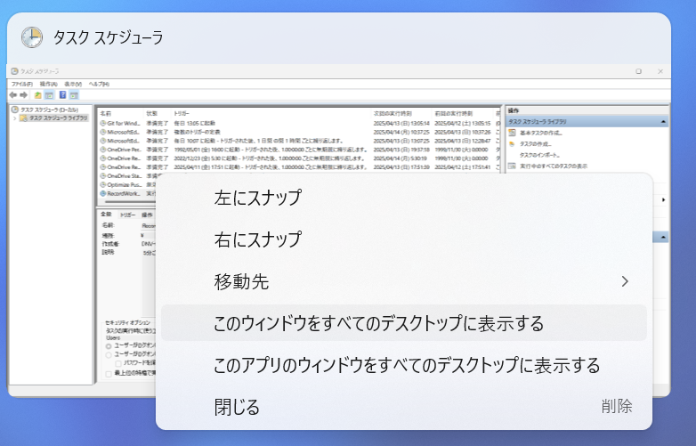
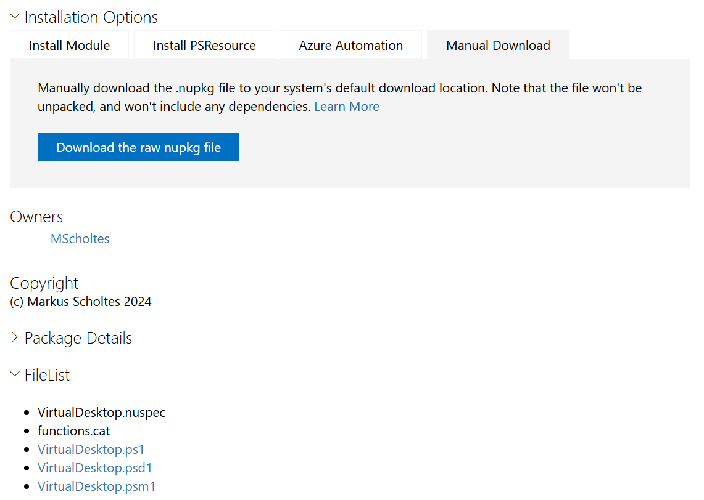

# Record-WorkedTimeAndDesktopName

現在の時刻とデスクトップ名を取得し、タブ区切りテキストとしてファイルへ書き込む。

## 目的

Windows 11 には「仮想デスクトップ」機能が搭載されており、下図のようにデスクトップ画面を複数作成し、それぞれに名前を付けることができる。


各デスクトップ画面それぞれの名称をタスク名に設定し、利用中のデスクトップのアクティブ時間を計測することで、各タスクに費やした時間を自動計測することが目的である。

### 目的の達成方法

まず、 Windows PowerShell の追加モジュールを使ったスクリプトを、タスクスケジューラーで定期的に呼び出し、以下のようなタブ区切りテキストファイル（ .tsv ）を出力する。

```text
2025/04/02	2025/04/02 09:00	2025/04/02 12:00	3.0	プロジェクト A
2025/04/02	2025/04/02 13:00	2025/04/02 14:00	1.0	プロジェクト B
2025/04/02	2025/04/02 14:00	2025/04/02 17:00	3.0	プロジェクト A
```

続いて、タブ区切りテキストはエクセルにコピペで貼り付ける。以下のような Excel ファイルを作っておき、「年月日」・「開始時刻」・「終了時刻」・「作業時間」・「作業種別」欄に貼り付ける。


作業時間の計算は Excel にやらせてもよい。

もしこのスクリプトの使い勝手が良ければ、最初から Excel に出力するように改造するかもしれない。

### 仮想デスクトップ利用時の注意点

Excel やメモ帳（ notepad.exe ）はファイルをダブルクリックしただけでは新プロセスを生成しないため、あるファイルを開こうとしてファイルをダブルクリックした際に別のデスクトップへ遷移してしまう。

これを防止するためには、該当するデスクトップで Excel やメモ帳を新プロセスで起動させればよい。
つまり、「 Windows キー + r」を押下し、以下のように新プロセスを開始することで対処できる。


ただし、 Excel についてはファイルをダブルクリックすると旧プロセスの Excel でファイルを開こうとしてしまうので、新プロセスの Excel でファイルを開きたいのであれば、ドラッグアンドドロップを実行しなければならない。

また、 Outlook や teams のように、すべてのデスクトップで表示させたいアプリもある。そのようなアプリがある場合、右クリックから設定することができる。



## 必要なツール

基本的に必要なツールは Windows 11 にプリインストール済み。 PowerShell のバージョンは、 PowerShell で `$PSVersionTable.PSVersion` を実行することで確認可能。

- Windows PowerShell 5.1 以上（ Windows 11 にプリインストール済み。）
  - [Virtual Desktop モジュール](https://www.powershellgallery.com/packages/VirtualDesktop/1.5.10) 1.5.10 以上
- conhost.exe （ Windows 11 にプリインストール済み。）
- タスクスケジューラー（ Windows 11 にプリインストール済み。）

## 準備

### 本ツールを指定フォルダへ配置する

本ツール Record-WorkedTimeAndDesktopName を `C:\workspace\development\project\Record-WorkedTimeAndDesktopName` へ配置する。
まだ v0.0.1 のお試し版のため、配置場所は固定とする。

### Virtual Desktop モジュールのインストールとインポート

Windows PowerShell で以下の順にコマンドを実行し、 Virtual Desktop モジュールをインストール・インポートする。

```powershell
# 管理者権限がある場合は -Scope CurrentUser の指定は不要。
Install-Module VirtualDesktop -Scope CurrentUser
Set-ExecutionPolicy RemoteSigned -Scope Process
Import-Module VirtualDesktop

# Virtual Desktop モジュールのインストールとインポートに成功していれば
# 以下のコマンドの実行でデスクトップ名を取得できる。
Get-DesktopName
```

VirtualDesktop モジュールのインストール時に以下の警告が表示されるが、どちらも Y を入力して進めること。

```powershell
続行するには NuGet プロバイダーが必要です
    PowerShellGet で NuGet ベースのリポジトリを操作するには、'2.8.5.201' 以降のバージョンの NuGet
    プロバイダーが必要です。NuGet プロバイダーは 'C:\Program Files\PackageManagement\ProviderAssemblies' または
    'C:\Users\xxx\AppData\Local\PackageManagement\ProviderAssemblies' に配置する必要があります。'Install-PackageProvider
    -Name NuGet -MinimumVersion 2.8.5.201 -Force' を実行して NuGet プロバイダーをインストールすることもできます。今すぐ
    PowerShellGet で NuGet プロバイダーをインストールしてインポートしますか?
    [Y] はい(Y)  [N] いいえ(N)  [S] 中断(S)  [?] ヘルプ (既定値は "Y"): Y

信頼されていないリポジトリ
    信頼されていないリポジトリからモジュールをインストールしようとしています。このリポジトリを信頼する場合は、Set-PSReposit
    ory コマンドレットを実行して、リポジトリの InstallationPolicy の値を変更してください。'PSGallery'
    からモジュールをインストールしますか?
    [Y] はい(Y)  [A] すべて続行(A)  [N] いいえ(N)  [L] すべて無視(L)  [S] 中断(S)  [?] ヘルプ (既定値は "N"): Y
```

NuGet はモジュールのインストールに必要なツールのため問題ない。
PowerShell Gallery が「信頼されていないリポジトリ」扱いされる理由はわからない。 Microsoft が運営しているリポジトリなのだが…。

### タスクスケジューラーへタスクをインポートする

続いて、タスクスケジューラーへタスクをインポートする。スタートメニューからタスクスケジューラーを起動する。


右ペインの操作メニューから［タスクのインポート］を選択し、同梱の `task/RecordWorkTimeDesktopName.xml` を選択する。


これで準備完了である。なお、タスクスケジューラーは以下の契機でスクリプトを呼び出す。

- 5 分ごと
- PC の起動時
- PC のシャットダウン・休止状態の実行時

## 使い方

準備が整うとタスクスケジューラーがスクリプトを実行し始め、フォルダに WorkedTimeAndDesktopName.log が出力される。

必要に応じて WorkedTimeAndDesktopName.log を開き、 Excel にコピペすれば作業時間を算出することができる。

## オマケ・お徳情報

### `Install-Module` コマンドでモジュールをインストールできない場合

もし、 PC に何らかの制限がかけられていてモジュールをインストールできなかった場合、手動ダウンロードによるインストールなら可能かもしれない。

#### モジュールの nupkg ファイルをダウンロードする

手動でモジュールをダウンロードするために [Virtual Desktop モジュール](https://www.powershellgallery.com/packages/VirtualDesktop/1.5.10) のページの [Manual download] タブから nupkg ファイルをダウンロードする。これは NuGet 向けに圧縮されたファイルである。



ダウンロード後、　PowerShell でファイルを展開するのであれば、以下の順にコマンドを実行する。

```powershell
Unblock-File -path .\virtualdesktop.1.5.10.nupkg
Rename-Item .\virtualdesktop.1.5.10.nupkg .\virtualdesktop.1.5.10.zip
Expand-Archive .\virtualdesktop.1.5.10.zip
```

エクスプローラー上でファイルを展開するのであれば、まずダウンロードした virtualdesktop.1.5.10.nupkg を右クリックし、ファイルへのアクセスを許可する。


そしてファイルの拡張子を .zip に変更し、右クリックメニューから zip ファイルを展開すればよい。

#### モジュールを配置する（インストールしたように見せかける）

`$Env:PSModulePath` を実行すると、モジュールの配置場所がわかる。

```powershell
$Env:PSModulePath
C:\Users\xxx\Documents\WindowsPowerShell\Modules;C:\Program Files\WindowsPowerShell\Modules;C:\WINDOWS\system32\WindowsPowerShell\v1.0\Modules
```

管理者権限なしでモジュールをインストールする場合、 `C:\Users\<ユーザー名>\Documents\WindowsPowerShell\Modules` に配置されるようなので、この場所に `C:\Users\<ユーザー名>\Documents\WindowsPowerShell\Modules\VirtualDesktop\1.5.10` フォルダを作成する。

そして、先ほど展開したファイルのうち、以下の 5 ファイルを `1.5.10` フォルダへ配置する。

- [Content_Types].xml
- functions.cat
- VirtualDesktop.ps1
- VirtualDesktop.psd1
- VirtualDesktop.psm1


この状態で PowerShell で以下のコマンドを実行できれば手動インストール成功である。

```powershell
Set-ExecutionPolicy RemoteSigned -Scope Process
Import-Module VirtualDesktop
Get-DesktopName
```

### Virtual Desktop モジュールの削除手順

何らかの理由で Virtual Desktop モジュールを削除しなければならなくなった場合、以下のコマンドを実行すればよい。

```powershell
Uninstall-Module VirtualDesktop
```

## ライセンス

- [WTFPL-2.0](http://www.wtfpl.net/)

## 参考資料

- MScholtes, VirtualDesktop , PowwerShell Gallery, 2025-03-03, <https://www.powershellgallery.com/packages/VirtualDesktop/1.5.10>
- MScholtes / sirAndros, PSVirtualDesktop, GitHub, 2025-03-03, <https://github.com/MScholtes/PSVirtualDesktop/tree/master>
- sdwheeler, パッケージの手動ダウンロード, Microsoft Learn, 2025-01-08, <https://learn.microsoft.com/ja-jp/powershell/gallery/how-to/working-with-packages/manual-download?view=powershellget-3.x>
- @yaju (やじゅ), タスクスケジューラでconhostを使用したPowerShellスクリプトの非表示化, Qiita, 2025-02-23, <https://qiita.com/yaju/items/715625c435969de6b9b1>
- 佐々木　真（ササキ　マコト）, conhost.exe, 「分かりそう」で「分からない」でも「分かった」気になれるIT用語辞典, 2024-06-15, <https://wa3.i-3-i.info/word13249.html>
- labo, 【Windows】起動・シャットダウンなどで発生するイベント, ラボラジアン, 2021-02-01, <https://laboradian.com/win-system-power-state-events/>
- @ryosuke0825 (りょうすけ), PowerShellの日付操作, Qiita, 2020-12-14, <https://qiita.com/ryosuke0825/items/06eae2e99f587b5275aa>
- マリモのごはん, PowerShell 四捨五入する（切り上げ、切り捨て）, note, 2024-04-01, <https://note.com/mahalo_/n/nbb97a373ee17>
