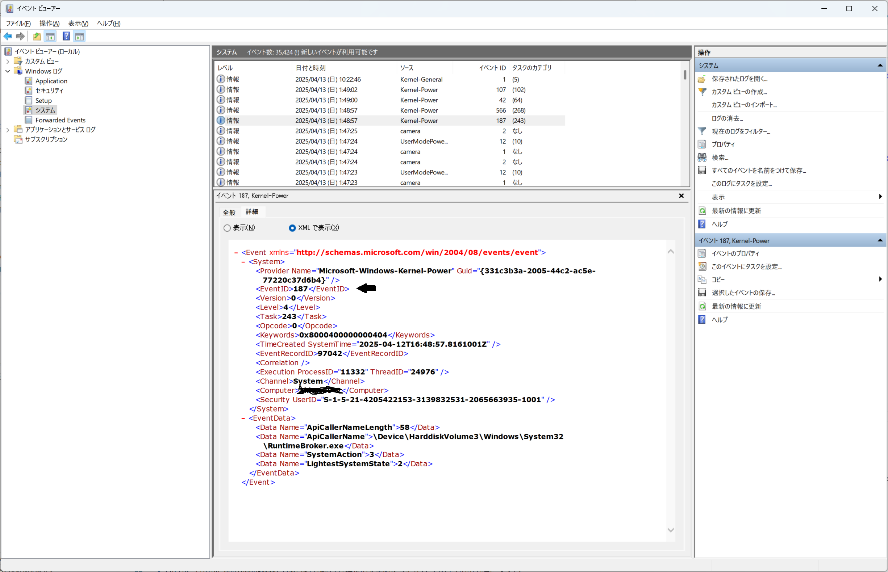

# タスクに関する説明

[README.md](../README.md) に記載の通り、タスクスケジューラーに XML ファイルをインポートしてタスクを追加することができる。

通常は GUI を操作してタスクを追加するのだが、一部の設定は XML を直接編集する必要があるため、その点に関する情報をここに記述する。

具体的には、タスクスケジューラーから呼び出すスクリプトの引数に変数を渡すための対応である。

## イベントの値の取得方法

RecordWorkTimeDesktopName.xml を開くと、以下の記述がある。

```xml
  <Triggers>
    <EventTrigger>
      <Enabled>true</Enabled>
      <Subscription>&lt;QueryList&gt;&lt;Query Id="0" Path="System"&gt;&lt;Select Path="System"&gt;*[System[Provider[@Name='Microsoft-Windows-Kernel-Boot'] and EventID=27]]&lt;/Select&gt;&lt;/Query&gt;&lt;/QueryList&gt;</Subscription>
      <ValueQueries>
        <Value name="EventID">Event/System/EventID</Value>
      </ValueQueries> 
    </EventTrigger>
    <EventTrigger>
      <Enabled>true</Enabled>
      <Subscription>&lt;QueryList&gt;&lt;Query Id="0" Path="System"&gt;&lt;Select Path="System"&gt;*[System[Provider[@Name='Microsoft-Windows-Kernel-Power'] and EventID=109]]&lt;/Select&gt;&lt;/Query&gt;&lt;/QueryList&gt;</Subscription>
      <ValueQueries>
        <Value name="EventID">Event/System/EventID</Value>
      </ValueQueries> 
    </EventTrigger>
    <EventTrigger>
      <Enabled>true</Enabled>
      <Subscription>&lt;QueryList&gt;&lt;Query Id="0" Path="System"&gt;&lt;Select Path="System"&gt;*[System[Provider[@Name='Microsoft-Windows-Kernel-Power'] and EventID=187]]&lt;/Select&gt;&lt;/Query&gt;&lt;/QueryList&gt;</Subscription>
      <ValueQueries>
        <Value name="EventID">Event/System/EventID</Value>
      </ValueQueries> 
    </EventTrigger>
    <TimeTrigger>
      <Repetition>
        <Interval>PT5M</Interval>
        <StopAtDurationEnd>false</StopAtDurationEnd>
      </Repetition>
      <StartBoundary>2025-04-12T21:00:00</StartBoundary>
      <Enabled>true</Enabled>
    </TimeTrigger>
  </Triggers>
```

`<ValueQueries>` タグが複数登場するが、この部分は一度エクスポートした XML ファイルに手動で追加したものである。この記述を追記すると、パワーオン、シャットダウン、休止状態のイベントをキャッチした際に、そのイベント番号を利用できるようになる。

```xml
<ValueQueries>
    <Value name="EventID">Event/System/EventID</Value>
</ValueQueries> 
```



## タスクスケジューラーの引数に変数を利用する方法

これが一番難しいというか、どうすれば実現可能なのか全然わからなかった。ChatGPT の DeepResearch 機能が見つけてくれて本当に助かった…。ほぼ隠し機能と言って良い。

タスクスケジュールが実行するコマンドは以下のように記述されている。

```xml
  <Actions Context="Author">
    <Exec>
      <Command>conhost</Command>
      <Arguments>--headless powershell -NoProfile -ExecutionPolicy Bypass -File C:\workspace\development\project\Record-WorkedTimeAndDesktopName\Record-WorkedTimeAndDesktopName.ps1 -EventID $(EventID)</Arguments>
      <WorkingDirectory>C:\workspace\development\project\Record-WorkedTimeAndDesktopName</WorkingDirectory>
    </Exec>
  </Actions>
```

このうち、`conhost` は画面に PowerShell の画面を表示させないために利用している（単純に powershell.exe を指定すると、一瞬画面に PowerShell のウィンドウが表示されてしまう。）

`-ExecutionPolicy Bypass` はダウンロードしたスクリプトもブロックせずに実行するための指定である。良いオプションではないのだが、 GitHub からダウンロードしたこのスクリプトを実行するために必要になるケースを踏まえて指定している。

そして、最も重要なのが `<Arguments>` の最後、 `Record-WorkedTimeAndDesktopName.ps1 -EventID $(EventID)` である。これこそが、タスクスケジューラーで引数を使うための記述！

`Record-WorkedTimeAndDesktopName.ps1` は 以下のように引数に `$EventID` を受け取る仕組みにしている。それを意味するのが `Record-WorkedTimeAndDesktopName.ps1 -EventID` までの部分である。

```powershell
param(
    $EventID
)
```

そして、名前が同じでわかりにくいが、最後の `$(EventID)` は先ほど追加したイベントを取得するクエリの値、`Value name="EventID"` を意味する。

```xml
<ValueQueries>
    <Value name="EventID">Event/System/EventID</Value>
</ValueQueries> 
```

このように記述することで、イベントビューアーから実行するスクリプトの引数に変数を渡すことが可能となる。

## 参考資料

- Masayuki.Ozawa, 特定の文字列を含むイベントログの出力時にタスクスケジューラーのタスクを実行できるか, SE の雑記, 2022-04-27, <https://blog.engineer-memo.com/2022/04/27/特定の文字列を含むイベントログの出力時にタス/>
- -, Scheduled Task - Trigerred by Event - Getting data into the scripts as parameters...- Question, Microsoft Learn, 2015-09-17, <https://learn.microsoft.com/en-us/archive/msdn-technet-forums/382b9023-01a9-4131-b2f2-8560b593bc3f>
